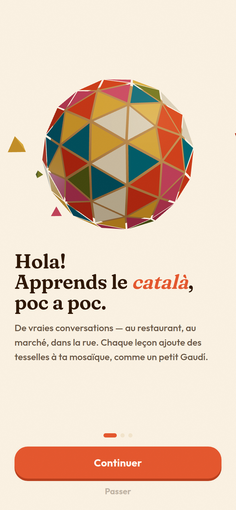
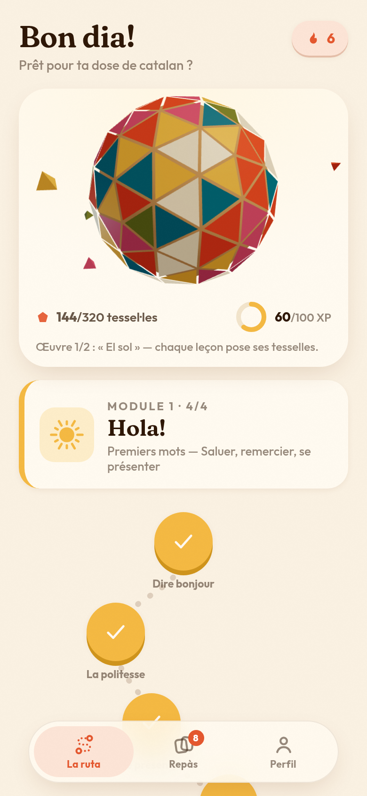
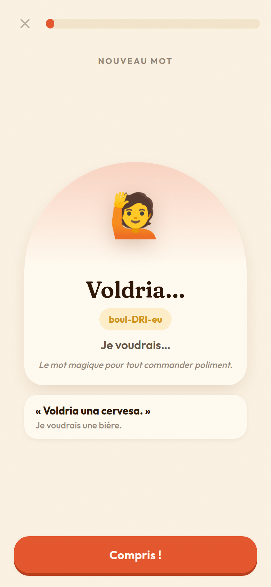
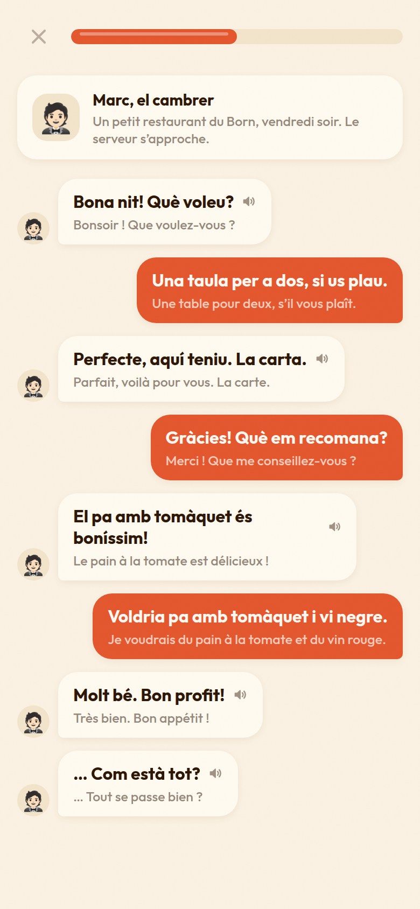
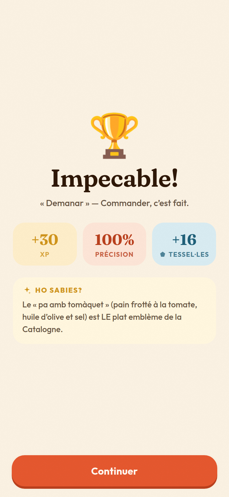
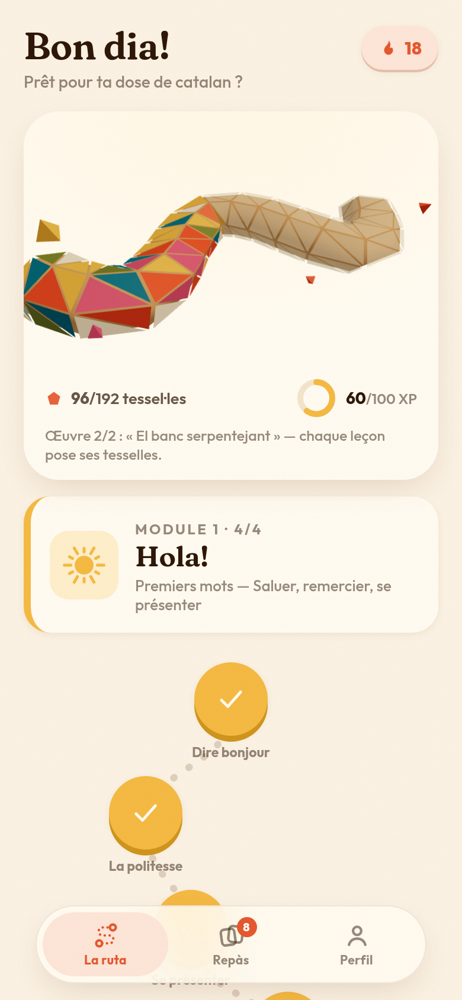
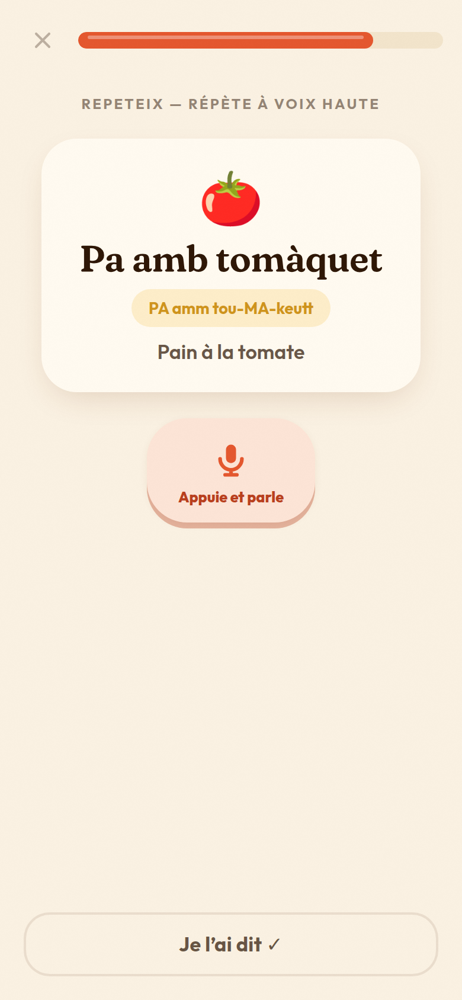
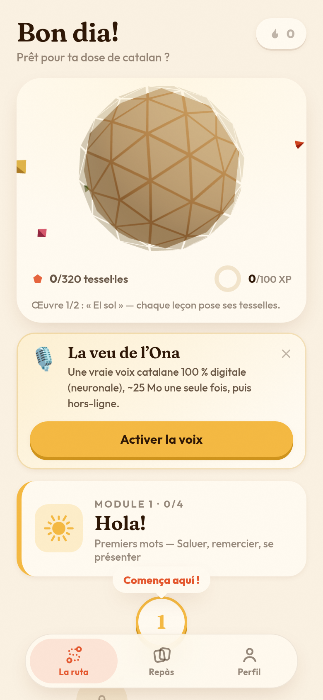

# Vinga! — Le catalan, poc a poc 🧡

Application mobile pour apprendre le **catalan depuis le français**. Objectif : comprendre et tenir
les conversations du quotidien — au restaurant, au marché, compter, demander son chemin.

| Onboarding | La ruta | Découverte | Conversa | Fin de leçon |
| --- | --- | --- | --- | --- |
|  |  |  |  |  |

| Œuvre 2 : le banc serpentin | Prononciation « Repeteix » | La veu de l'Ona |
| --- | --- | --- |
|  |  |  |

## Le concept : la progression devient une œuvre

Pas de barre de progression ni de flamme culpabilisante : chaque leçon terminée pose des
**tessel·les sur des mosaïques trencadís 3D** (hommage à Gaudí) que l'on reconstruit en apprenant.
Deux œuvres se succèdent, rendues en WebGL et manipulables du doigt : **el sol** (sphère,
320 tesselles — les 5 premiers modules) puis **el banc serpentejant** de Park Güell
(192 tesselles — les modules A2).

## L'expérience

- **La ruta** — un chemin sinueux à travers 8 modules : `Hola!` (saluer), `Els nombres` (compter),
  `Al restaurant`, `Al mercat` (les courses), `Pel carrer` (le chemin), puis les modules A2
  `El temps` (météo, jours, heure), `La família` et `A la platja` (sorties). 32 leçons, ~200 mots.
- **6 types d'exercices** — découverte (carte-arche), QCM dans les deux sens, écoute (synthèse
  vocale catalane), paires, construction de phrases, et **« Repeteix »** : prononciation évaluée
  par reconnaissance vocale (`ca-ES`) quand le navigateur la propose, répétition auto-évaluée
  sinon. Les erreurs sont recyclées en fin de leçon, sans système de vies punitif.
- **Converses** — chaque module se termine par un dialogue simulé (serveur, marchande, passant,
  voisine, amie à la plage…) : le PNJ parle (audio + traduction), on répond en choisissant de
  vraies répliques. C'est l'entraînement direct de l'objectif : tenir une conversation.
- **Repàs** — répétition espacée légère : les mots appris reviennent à échéance (10 min → 1 j → ×2,5).
- **La motxilla** 🎒 — sauvegarde portable de la progression (Profil → Progression) : un code
  compact `VINGA1.…` à copier ou un fichier `.json`, restaurable sur n'importe quel appareil.
- **Phonétique pour francophones** — chaque mot est accompagné d'une prononciation lisible
  (`Gràcies` → « GRA-si-euss »), la syllabe accentuée en capitales.
- **Gamification douce** — XP, objectif quotidien, série de jours (ratxa), jalons (fites),
  anecdotes culturelles « Ho sabies? » en fin de leçon.

## Design

- **Direction artistique méditerranéenne** : crème chaude, terracotta, jaune soleil, bleu mer,
  olive, rose bougainvillier ; arches, céramique, grain de papier.
- **Typographie** : Fraunces (serif expressive, axes SOFT/WONK) pour le catalan et les titres,
  Outfit pour l'interface.
- **Motion** : ressorts framer-motion partout (boutons 3D-press, listes en cascade, transitions
  d'écrans), confettis de tesselles en canvas, bulles de dialogue animées.
- **3D** : œuvres trencadís react-three-fiber (chargées en différé), éclat par éclat — la sphère
  se pave du haut vers le bas, le banc de gauche à droite.
- **Sons** : petits effets synthétisés en Web Audio (aucun asset), haptique sur mobile.
- Respect de `prefers-reduced-motion`, cibles tactiles ≥ 44 px, contrastes AA.

## La voix — un système 100 % digital, à trois niveaux

1. **« La veu de l'Ona »** — voix catalane **neuronale** (Piper/VITS, voix `ca_ES-upc_ona`
   entraînée sur le corpus FestCat de l'UPC de Barcelone) exécutée **dans le navigateur en
   WebAssembly**. Le modèle (~25 Mo) se télécharge une seule fois sur l'appareil (bannière
   d'activation sur l'accueil, réglage dans le profil), est mis en cache (OPFS) puis fonctionne
   **hors-ligne**. Les répliques d'une leçon sont pré-synthétisées en arrière-plan et mémorisées,
   donc chaque tap est instantané.
2. **Repli** : la synthèse vocale de l'appareil (`speechSynthesis`, voix `ca` puis `es`).
3. **Toujours** : la phonétique française visible sur chaque mot, avec bouton 🐢 « lentement »
   sur les exercices d'écoute.

Si le téléchargement échoue (hors-ligne, réseau restreint), l'app le dit clairement et continue
avec les niveaux 2-3 — ce chemin est couvert par le harnais de test.

## Ouvrir l'application

**Essayer en 30 secondes (démo jouable)** : la version un-fichier est publiée ici —
<https://claude.ai/code/artifact/9625a292-83db-4ab9-ab33-bb7a4faf685c>. Le lien se partage depuis
le menu de partage de la page (elle est privée par défaut). Dans cette démo la voix neuronale et
le micro sont désactivés (audio de repli), et la progression se conserve via la motxilla
(Profil → Progression → Exporter).

**En local (développement)** :

```bash
cd vinga
npm install
npm run dev        # http://localhost:5173
```

Le serveur écoute aussi sur le réseau local (`host: true`) : ouvre l'URL « Network » affichée
dans le terminal depuis ton téléphone connecté au même wifi.

**En production** : `npm run build` puis servir `dist/` (ou `npm run preview`). Sur Vercel ou
Netlify : importer le repo, répertoire racine `vinga`, commande `npm run build`, dossier `dist`.
C'est une **PWA installable** : ouverte sur un téléphone, « Ajouter à l'écran d'accueil »
l'installe en plein écran (manifeste + icônes fournis). Le même code peut être empaqueté en app
iOS/Android native via Capacitor.

**Version démo un-fichier** : `npm run build:onefile` produit `vinga-onefile.html`, une page
autonome (JS, CSS et polices inlinés, ~1,5 Mo) qui s'ouvre n'importe où — la voix neuronale y est
volontairement désactivée (elle inlinerait ~70 Mo de WASM et les pages partagées bloquent le
téléchargement du modèle), l'app suit alors ses niveaux de repli audio.

## Vérification

`node scripts/shots.mjs` pilote l'app dans un Chromium headless (390×844) : il déroule
l'onboarding, joue une leçon complète en résolvant réellement chaque exercice, mène un dialogue,
et capture chaque écran. Sert à la fois de test de fumée et de générateur de captures.

## Structure

```
src/
  data/        contenu pédagogique (modules, mots, dialogues) + générateur d'exercices
  lib/         synthèse vocale, sons/haptique, répétition espacée
  components/  icônes, emblèmes-céramique, sphère 3D, confettis, barre d'onglets
  screens/     onboarding, ruta, leçon (5 exercices + dialogues), repàs, profil
  store.ts     progression persistée (XP, ratxa, SRS, leçons) — zustand
```

## Pistes suivantes

- Voix haute qualité (modèle `medium`) en option, et voix masculine « Pau » pour les personnages
  des dialogues ; auto-hébergement des WASM/modèles pour se passer des CDN
- Une troisième œuvre à reconstruire : le drac de Park Güell
- Notifications de rappel et builds natifs iOS/Android via Capacitor ; contenu B1
